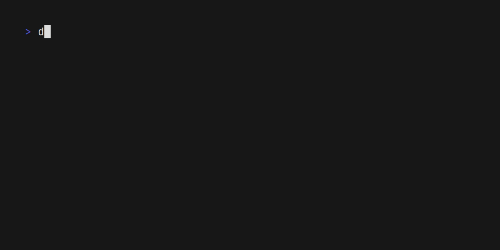

# Mint Tea

A fun, functional, and stateful way to build terminal apps in OCaml heavily inspired by [BubbleTea][bubbletea]. MintTea is
built on Riot and uses The Elm Architecture.

[bubbletea]: https://github.com/charmbracelet/bubbletea

